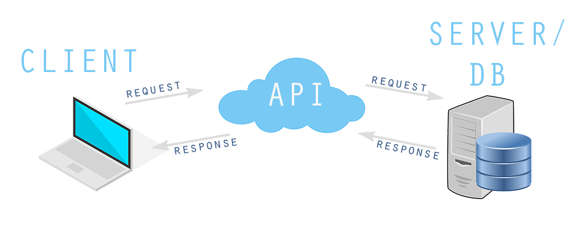

This post is meant to simplify the term RESTful API for people who started learning web development recently and wants to know more about server side architecture. Can’t be more simple than this.

#What is RESTful API?

API stands for Application Programming Interface and RESTful is a set of standards APIs are based on. It is a set of functions that takes request from a client, executes some action and than brings him back the response. Actions you can make are: Create, Read, Update and Delete and that’s why apps built on these actions are called CRUD.

**Real life analogy**: Imagine you are at the table in one of the finest restaurants in Monaco, somewhere in Monte Carlo with your darling sitting by the sea listening to some nice [French music](https://www.youtube.com/watch?v=gFkUVik35U8) in the background. You would like to try one of the famous French Specialties, so you call the Waiter to make an order for Moules Marinières. He than goes to the Kitchen and tells the Chef to make Moules Marinières. When the food is ready, Chef pass the food to the waiter and he brings it to your table.

**In plain Language**: You want to login to facebook and display your facebook data(News Feed) so you make a request with username and password. Than, facebook’s API(waiter) makes request to the server(kitchen) and database(Chef) for your data(food). When your data is ready, API’s response is to bring you back your data so you can see a News Feed.

Simple? Well, in theory yes.

Best way to learn is to actually build your own, so go to Part II and let’s build a simple RESTful API with Node, Express and Mongo DB…

Bon Appétit

