In the previous [part]() we went through the mere concept of RESTful API, what it is and what is it used for. In this part we are going to actually build one and when you are done everything will clear up as a crystal.

OK, Let’s Do This!


**Prerequisites**:

1. Code Editor(I use VS Code)
2. Node JS
3. MongoDB (Community Server version)
4. Robo 3T (MongoDB GUI)
5. Postman (For Testing API)

Download & Install them all. Also, we will build API in es2015(or es6) Javascript syntax so make sure you have Babel extension installed in your text editor to compile it to es5.

This was the harder part Actually.

#Step 1 — Setting Up Database

First we need to get our database up and running. Make a database directory wherever you want and then go into directory where MongoDB is installed and start the database from command prompt. It should look something like this:

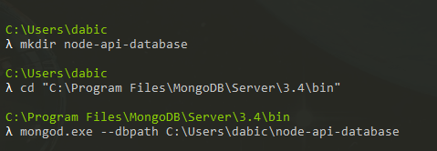

Press enter, You should be connected to port 27017 like this:

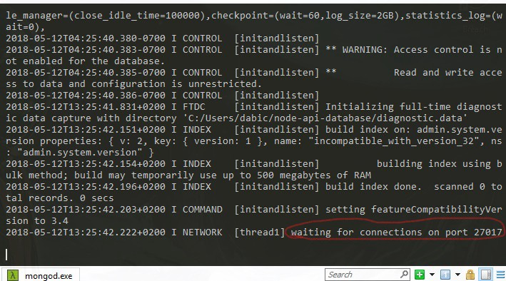

That’s It ! You have now set up a Mongo Database. In our database we will store user info(email and password) like in the most of the web applications is required. During the Development process you have to leave this command prompt like this and start another one for API development.

#Step 2 — Setting up a Server

Make a directory for our API wherever you want and enter it with command prompt as within your text editor(mine is VS Code).
```
cd rest-node-api
```

First we have to setup our package.json file so we can install our dependencies for this project. in the command prompt:
```
npm init -y
```
This will setup our default package.json file which can be seen as ingredients list of our recipe.

Now let’s install Express. The best web framework for NodeJS development.
```
npm i express --save
```

package.json file should look like this:

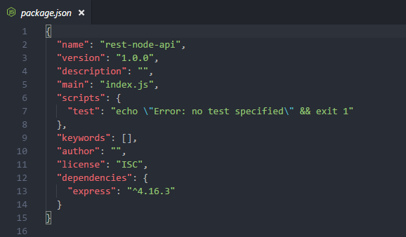

And all of our further dependencies will be shown here like this. OK, Lets set up a server.

Make *server.js* file in your root folder in text editor, require express, make app variable to use express and set up a port where the app will run. It should look like this:

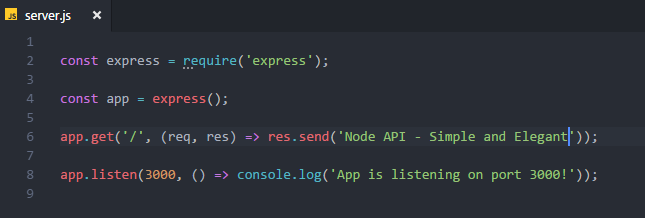

Save file and go to command prompt to start the server.
```
node server.js
```
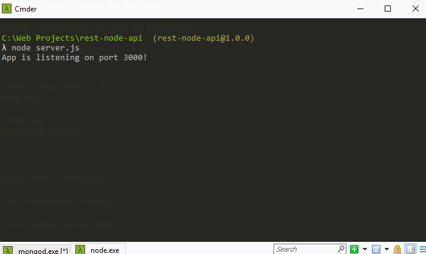

One more thing. go to your browser and type in the url window:
```
http://localhost:3000/
```
You should get the message:

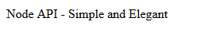

Everything is set to start our API development.

#Step 3 — Model

>Models are fancy constructors compiled from our Schema definitions. Instances of these models represent documents which can be saved and retrieved from our database. All document creation and retrieval from the database is handled by these models.

To set up our model we need [Mongoose](mongoosejs.com).

>Mongoose provides a straight-forward, schema-based solution to model your application data. It includes built-in type casting, validation, query building, business logic hooks and more, out of the box.

Our Model will be consisted of 2 things:

1. Setting up collection in our database
2. Building Schema for our collection

*Collection and Schema together make Model and will be more cleared up during the building process. So let’s proceed.*

First let’s install Mongoose:

```
npm i mongoose --save
```

Now let’s create 2 new folders: First will be named model with created file: user.js and the Second will be named db with file: mongoose.js. Our root folder should look like this:

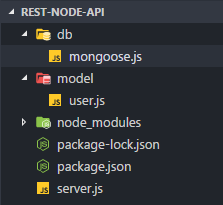

Open a mongoose.js file and in this file we will open a connection to the Users database on our locally running instance of MongoDB(localhost:27017). Also, we should get notified in our console if we connected successfully:

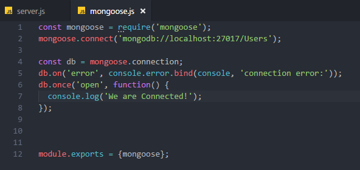

Next we have to set up our User Schema. Schema is a blueprint of our user data and what it will be consisted of:

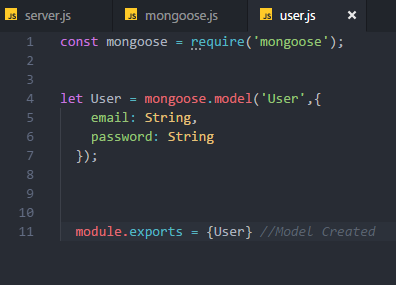

As you can see, our user model is only made of 2 parameters: email and password which will be strings. This is the simplest form of Schema for the purpose of better understanding. Usually, there are more than one Schema in a web application and it’s consisted of many more parameters such as: login time, location, age, credit card number etc.

Now, all that’s left for this section is to import these two files into our main server.js file.

```javascript
//server.js

const {mongoose} = require('./db/mongoose');

const {User} = require('./model/user');
```

#Step 4 — Routing

Routing part is the most important and here we will implement main functions and CRUD actions of API. We use these actions to make HTTP requests to the server.

Routs are made of 2 parts: url and function regarding this url.

Before we dig into building routes we need to install 2 more dependencies:

1. mongodb — ObjectID value to check if our ObjectId is valid
2. body-parser — To read the body of a database and parse it into a JSON to be more readable

```
npm i mongodb body-parser --save
```

When installed, check them in your package.json and then import them into our server.js file

```javascript
//server.js

const {ObjectID} = require('mongodb');

const bodyParser = require('body-parser');
```

Bellow app variable let’s put body-parser in use

```javascript
app.use(bodyParser.json());
```

OK! Now we are ready to define our CRUD actions. We will write function promises async/await way. This is the best and modern way to write promises. If you are unfamiliar, you can check my previous post(HERE) where is very simplified for everyone to understand.

##Create(POST)

This action occurs when we are posting an image or a quote online or when we are registering to a website. Everything ends up in a Database somewhere. Now, you are going to see how it functions behind the scenes and you will build this functionality yourself.

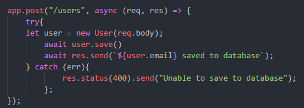

Let’s break this down.

First we define url route where we want to store our users collection and async function. Then, we define new User with body-parser(req.body) to parse our data into JSON to be more readable and maintainable. Then we save our data and send the response. Also, define catch for error handling if something goes wrong. Save the file and let’s test this function.

Finally we got to usage of Postman and Robo3T apps.

First Start the server

```
node server.js
```

Then, go into Postman

Left, in dropdown choose POST and type our localhost:3000 url with our users collection in url window.

Then, bellow url window choose Body -> raw and right in the dropdown where it says text change it to JSON.

And bellow in the body window type email and password of your choice.

Click Send in the Upper right


Then, Open Robo3T and connect to our localhost 27017. Check our Users database and in collections double click to open users collection.


##Read(GET)

This action occurs when we are trying to fetch our data. For example: When we log into facebook we want to GET our data(first name, last name, age, likes, posts etc.). It’s basically extracting data from a database, usually to show on a client side.

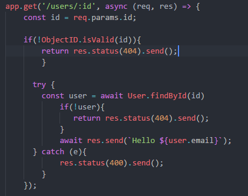

First we have to define url so we can look up a user by his id(ObjectId). Then define route parameter in id variable. Check if our ObjectId is valid. We have to use Mongoose method *findById()* to find a user by his id, check if we got the right user, If we did, we get response that everything is ok. Also, catch errors if there are any. Save the changes and restart the server.

Now we have to test this in Postman, but before that let’s grab ID of a user we just posted from Robo3T. Right click on _id → view document and copy ObjectId to clipboard.

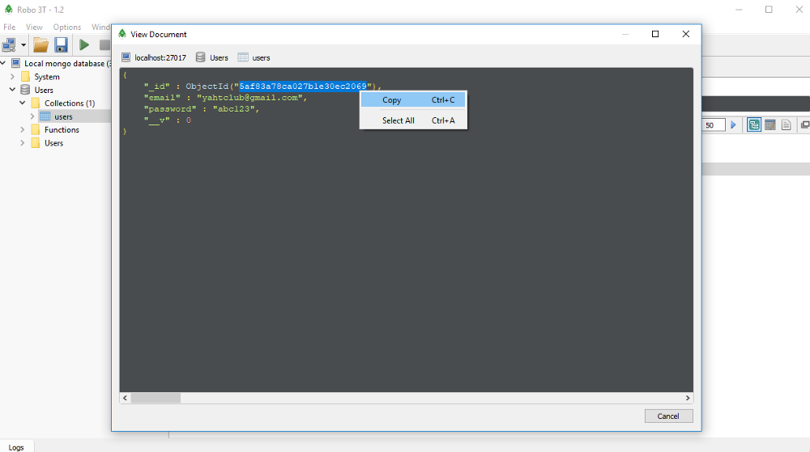

Go to Postman, Change request from POST to GET and paste ObjectId in the url window where users are stored and click send.


##Update(Patch)

To Change our data we have to make PATCH request.

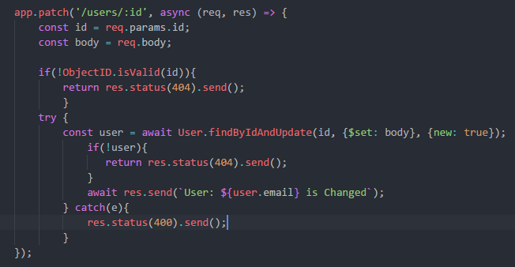

First, let’s define route parameters for Id and our body object in separate variables. Then, Check validity of ObjectId as in previous request. Define user variable and apply mongoose method: *findByIdAndUpdate()* to our User Model and we pass our route params, ${set}: body, to specify what are we going to change and *new:true* means to return new modified document. Then we check if we changed the user we wanted and send the response. Also, as always, catch an error if there are any. Save the changes and restart the server.

Now, go to Postman and let’s change our users password

Choose PATCH, leave the url as it was with the same user. Go to body and change the password with one of your own choice. Click send.


Go to Robo3T, refresh our Users database, double click again on our users collection and see that our user has a new password.


##Delete

This, I will leave you as a **Challenge**. It’s very similar to what we have done so far,so don’t worry. Also, I will leave you some tips:

```javascript
//use app.delete with /users/:id since we want to delete user with specific id
//make async function with request and response arguments
//define route params for id
//Check the validity of ObjectId
//define user with findByIdAndRemove() mongoose method
//Check if the right user got removed
//Send the response back
//don't forget to catch errors
```

Test in Postman with DELETE request. If you get status 200 and a response you defined, check your Robo3T users collection. If your collection is empty: Good Job! You successfully made a delete route for RESTful API.

Solution you can find in [this repository](https://github.com/Count-D/rest-node-api-medium).

#That’s It!

Congratulations, You’ve just built your first RESTful API. This is of course, not a production app and is made only for educational purpose. Usually, RESTful APIs have more Complex Models and Routes, also have things like Authentication Middleware and there is a lot more to it. But this is a great starting point to enter the world of Web Programming and to see how web applications work under the hood.


Thank you for reading and going through this small course, I’ll be very happy if I helped you even a little bit, because I know that you need multiple sources to get real grasp on complex concepts like RESTful APIs

If you have any suggestions or stumble upon any troubles during development, I’ll be happy to give you response.

Cheers!
