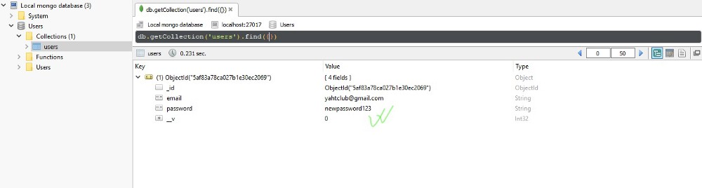

#Step 4 — Routing

Routing part is the most important and here we will implement main functions and CRUD actions of API. We use these actions to make HTTP requests to the server.

Routs are made of 2 parts: url and function regarding this url.

Before we dig into building routes we need to install 2 more dependencies:

1. mongodb — ObjectID value to check if our ObjectId is valid
2. body-parser — To read the body of a database and parse it into a JSON to be more readable

```
npm i mongodb body-parser --save
```

When installed, check them in your package.json and then import them into our server.js file

```javascript
//server.js

const {ObjectID} = require('mongodb');

const bodyParser = require('body-parser');
```

Bellow app variable let’s put body-parser in use

```javascript
app.use(bodyParser.json());
```

OK! Now we are ready to define our CRUD actions. We will write function promises async/await way. This is the best and modern way to write promises. If you are unfamiliar, you can check my previous post(HERE) where is very simplified for everyone to understand.

##Create(POST)

This action occurs when we are posting an image or a quote online or when we are registering to a website. Everything ends up in a Database somewhere. Now, you are going to see how it functions behind the scenes and you will build this functionality yourself.


Let’s break this down.

First we define url route where we want to store our users collection and async function. Then, we define new User with body-parser(req.body) to parse our data into JSON to be more readable and maintainable. Then we save our data and send the response. Also, define catch for error handling if something goes wrong. Save the file and let’s test this function.

Finally we got to usage of Postman and Robo3T apps.

First Start the server

```
node server.js
```

Then, go into Postman

Left, in dropdown choose POST and type our localhost:3000 url with our users collection in url window.

Then, bellow url window choose Body -> raw and right in the dropdown where it says text change it to JSON.

And bellow in the body window type email and password of your choice.

Click Send in the Upper right


Then, Open Robo3T and connect to our localhost 27017. Check our Users database and in collections double click to open users collection.


##Read(GET)

This action occurs when we are trying to fetch our data. For example: When we log into facebook we want to GET our data(first name, last name, age, likes, posts etc.). It’s basically extracting data from a database, usually to show on a client side.


First we have to define url so we can look up a user by his id(ObjectId). Then define route parameter in id variable. Check if our ObjectId is valid. We have to use Mongoose method *findById()* to find a user by his id, check if we got the right user, If we did, we get response that everything is ok. Also, catch errors if there are any. Save the changes and restart the server.

Now we have to test this in Postman, but before that let’s grab ID of a user we just posted from Robo3T. Right click on _id → view document and copy ObjectId to clipboard.


Go to Postman, Change request from POST to GET and paste ObjectId in the url window where users are stored and click send.


##Update(Patch)

To Change our data we have to make PATCH request.


First, let’s define route parameters for Id and our body object in separate variables. Then, Check validity of ObjectId as in previous request. Define user variable and apply mongoose method: *findByIdAndUpdate()* to our User Model and we pass our route params, ${set}: body, to specify what are we going to change and *new:true* means to return new modified document. Then we check if we changed the user we wanted and send the response. Also, as always, catch an error if there are any. Save the changes and restart the server.

Now, go to Postman and let’s change our users password

Choose PATCH, leave the url as it was with the same user. Go to body and change the password with one of your own choice. Click send.


Go to Robo3T, refresh our Users database, double click again on our users collection and see that our user has a new password.



##Delete

This, I will leave you as a **Challenge**. It’s very similar to what we have done so far,so don’t worry. Also, I will leave you some tips:

```javascript
//use app.delete with /users/:id since we want to delete user with specific id
//make async function with request and response arguments
//define route params for id
//Check the validity of ObjectId
//define user with findByIdAndRemove() mongoose method
//Check if the right user got removed
//Send the response back
//don't forget to catch errors
```

Test in Postman with DELETE request. If you get status 200 and a response you defined, check your Robo3T users collection. If your collection is empty: Good Job! You successfully made a delete route for RESTful API.

Solution you can find in [this repository](https://github.com/Count-D/rest-node-api-medium).

#That’s It!

Congratulations, You’ve just built your first RESTful API. This is of course, not a production app and is made only for educational purpose. Usually, RESTful APIs have more Complex Models and Routes, also have things like Authentication Middleware and there is a lot more to it. But this is a great starting point to enter the world of Web Programming and to see how web applications work under the hood.


Thank you for reading and going through this small course, I’ll be very happy if I helped you even a little bit, because I know that you need multiple sources to get real grasp on complex concepts like RESTful APIs

If you have any suggestions or stumble upon any troubles during development, I’ll be happy to give you response.

Cheers!
